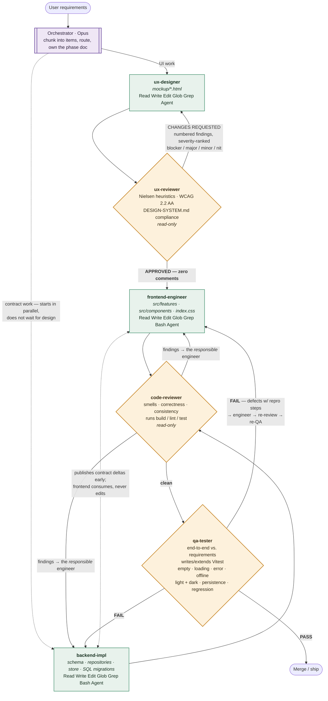
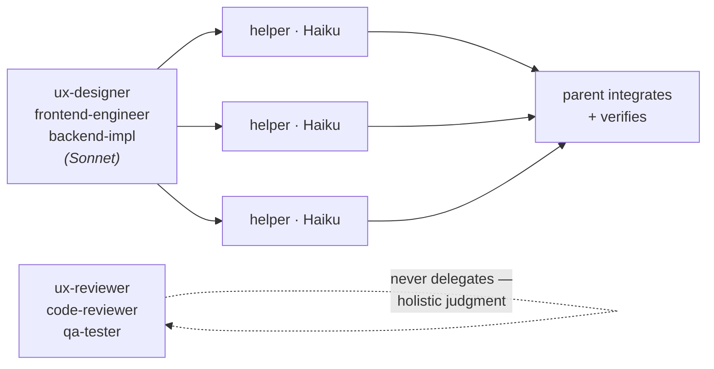

# Agentic workflow pipeline

How feature work gets built in this repo. The orchestrator (Opus, the main session) chunks
requirements and routes them to six specialist subagents defined in `.claude/agents/`, all
pinned to **Sonnet**. Two quality gates loop until they're satisfied; nothing ships past a
gate that still has comments.

## The pipeline

**The two hard gates.** `ux-reviewer` only returns `APPROVED` at *zero* comments — it does
not rubber-stamp, and it does not manufacture blockers to prolong the loop. `qa-tester`
runs **only after** `code-reviewer` has fully approved; a defect it finds goes back to the
responsible engineer, then back through code review, then back to QA. Neither gate edits
files — they produce judgment, which is what keeps them honest about the work.

## Haiku fan-out

The three agents that *write* code may parallelise genuinely independent subtasks onto
**Haiku** helpers (`subagent_type: "general-purpose"`, `model: "haiku"`). The parent always
owns integration and final verification.

Fan out only **self-contained** tasks: "port these CSS tokens", "write the empty-state
markup for one panel", "restyle the budget category bars". Anything interdependent,
state-critical, or contract-shaping stays under the parent's own hand.

## Who owns what

| Agent | Model | Writes? | Territory |
|---|---|---|---|
| **orchestrator** | Opus | yes | Chunks requirements, routes work, owns `PHASE*.md`, makes the calls that are the user's to confirm |
| **ux-designer** | Sonnet | `mockup/` only | Self-contained static HTML/CSS/JS mockups. **Never touches `src/`** |
| **ux-reviewer** | Sonnet | no | Heuristics, WCAG 2.2 AA, design-system compliance. Verdict + severity-ranked findings |
| **backend-impl** | Sonnet | `src/data`, `src/store`, `supabase/` | Schema, repositories, store actions, migrations, autoplan. Holds the overarching view |
| **frontend-engineer** | Sonnet | `src/features`, `src/components`, `src/index.css` | Implements the *approved* mockup. Consumes contracts, never reshapes them |
| **code-reviewer** | Sonnet | no | Correctness, smells, consistency. May run `build` / `lint` / `test` |
| **qa-tester** | Sonnet | test files only | End-to-end behaviour + Vitest coverage. Does **not** rewrite production code — defects go back to the engineer |

## The rules that make it work

- **Design before implementation.** Non-trivial UI goes through mockup + review first. The
  approved mockup is the source of truth the frontend is built to match.
- **Frozen contracts are one-way.** `src/data/schema.ts`, `tripRepository.ts`, `seed.ts`,
  `useTripStore.ts`, `lib/autoplan.ts` carry `FROZEN CONTRACT` headers. The
  frontend-engineer **flags** a needed contract change to the orchestrator rather than
  editing it — it gets routed to `backend-impl`, which publishes the delta back.
- **The two tracks run in parallel.** `backend-impl` starts alongside the *design* track,
  not after it, so the seams are ready when the frontend begins.
- **Read `mockup/DESIGN-SYSTEM.md` first** — every agent that touches design or CSS. It is
  the written-down token set, semantic colour vocabulary, contrast rules and a11y floor.
  Do not re-derive it from the stylesheet.
- **Green gates are not proof.** A fully green suite has missed real defects here before
  (unmemoized `onClose` breaking typing; debounce refs shared across places; a raw
  `TypeError` surfaced to the user offline). Independently re-verify an agent's claims —
  reverting a fix and watching the test fail beats trusting a green run.
- **Check the documented traps first.** Each `PHASE*.md` lists predicted failure modes. In
  Phase 4 a documented trap fired *exactly as written* and was caught only because someone
  went looking for it.
